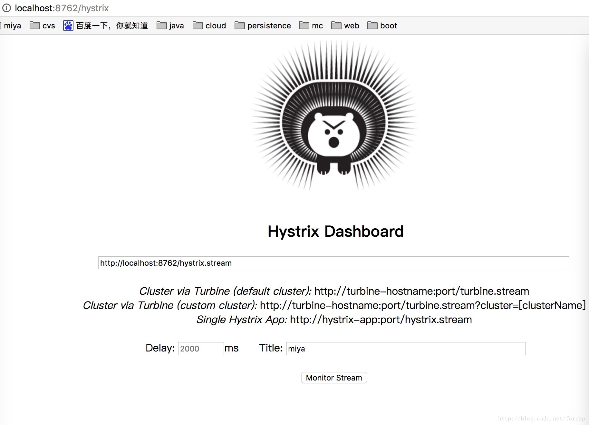

# zhabei-hystrix-dashboard
除了隔离依赖服务的调用外，Hystrix还提供了近乎实时的监控，Hystrix会实时的，累加的记录所有关于HystrixCommand的执行信息，包括执行了每秒执行了多少请求，多少成功，多少失败等等\

## 项目依赖
1. hystrix-dashboard模块。
```
<dependency>
    <groupId>org.springframework.cloud</groupId>
    <artifactId>spring-cloud-starter-hystrix-dashboard</artifactId>
</dependency>
```

## 项目启动类
在项目启动类上添加`@EnableDiscoveryClient`注解，可以将服务注册至Eureka。  
在项目启动类上添加`@EnableHystrixDashboard`注解，默认为HystrixDashboard项目。  
```
@EnableHystrixDashboard
@EnableDiscoveryClient
@SpringBootApplication
public class HystrixDashboardApplication {

    public static void main(String[] args) {
        SpringApplication.run(HystrixDashboardApplication.class, args);
    }
} }
}
```


## 配置文件
server.port为项目端口。
spring.application.name为项目名称。
eureka.client.serviceUrl.serviceUrl为eureka的地址
```
server:
  port: 8095
spring:
  application:
    name: zhabei-hystrix-dashboard
eureka:
  client:
    serviceUrl:
      defaultZone: http://localhost:8761/eureka/
  instance:
    prefer-ip-address: true
```

## 启动
启动后可以访问 `localhost:8095/hystrix` 获得数据。  

